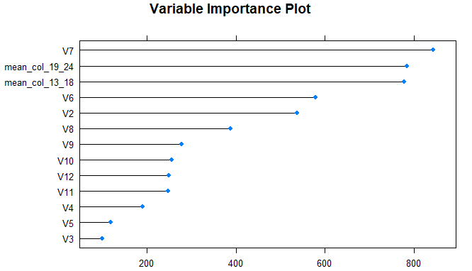
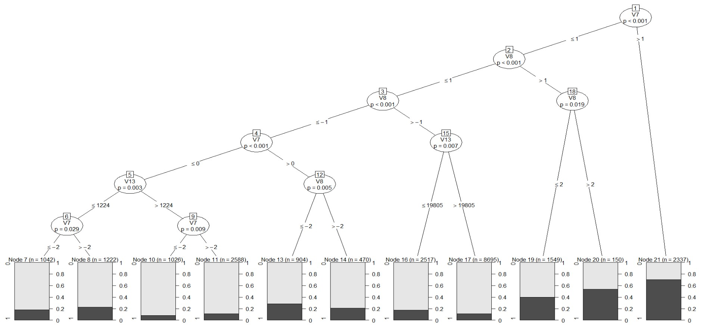

```{r setup, echo = F, include = F}
library(knitr)
library(dplyr)
library(readxl)
library(ggplot2)
library(corrplot)
library(Hmisc)
library(caret)
library(leaps)
library(e1071)
library(ggcorrplot)
library(ranger)
library(caret)
library(data.table)
library(nnet)
library(NeuralNetTools)
library(smotefamily)
library(ROSE)
library(rpart)
library(ROCR)
library(pROC)
library(caTools)
library(partykit)
library(grid)
library(mvtnorm)
library(libcoin)
library(mlbench)
library(randomForest)
```

```{r img-with-knitr, echo=F, fig.align='center', out.width='50%'}
knitr::include_graphics("nus_logo_full-vertical.jpg")
```

```{r name, echo=FALSE, fig.align='center', out.width='100%'}
nameV <- c("Cheong Wen Wei", "Gao Heng", "Hom Lim Jun How", "Lee Jun Wei")
numV <- c("A0233582E", "A0234014X", "A0235131W", "A0230329M")
cover <- data.frame(nameV, numV)
colnames(cover) <- c("Student Name", "Student Number")
kable(cover, align='c', padding=30)
```
\pagenumbering{gobble}
\pagebreak
\pagenumbering{arabic}
\setcounter{page}{2}
\setcounter{tocdepth}{4}
\tableofcontents
\newpage
```{r read data, echo=F}
data <- read.csv("card.csv", sep = ",", skip = 2, header = FALSE)
data_v <-data
header <- scan("card.csv",sep=",",nlines=2,what=character())
```
# Overview
## Problem Description
<p align="justify">
This project endeavours to accurately predict customers who will default on their bills from those who will pay promptly. More importantly, being able to accurately predict customers who will default would allow banks to minimised potential losses that would potentially be written off as bad debt. Therefore, a stronger emphasis is being placed on being able to accurately predict customers who will default.
</p>
## Data
<p align="justify">
The dataset used for this project contains information of 30,000 credit card holders obtained from a bank in Taiwan. Each credit card holder is described by 23 feature attributes, a unique customer identification corresponding to each credit card holder as well as each credit card holder's default status.
</p>
# Exploratory Data Analysis
## Structure of the Data
<p align="justify">
The first crucial step is to find out more about the dataset. By exploring the structure of the data, it can be discerned that all variables read in were of type integer. However, it is clear that variables V3 (Gender), V4 (Education Level), V5 (Marital Status) and V7 to V12 (Repayment Status) should not be treated as integers. Instead, the aforementioned variables would be converted to a factor to better represent the data.
</p>
```{r data structure, echo=F}
str(data)
```
\newpage
## Missing Values
<p align="justify">
In this section, a check was performed to identify any missing or N.A. values. From the check, it was identified that there were no missing or N.A. values in the data. Thereafter, a summary of the variables is shown with the exception of V1 which is the customer identification.
</p>
```{r data preprocessing checking for NA Values, echo=F}
#Checking for NA values
#any(is.na(data))

summary(data[2:25])
```
## Distribution of the Data
### Target Variable
<p align="justify">
The distribution of the target variable was explored using the table function in R. 
</p>
```{r Exploratory Data Analysis for V25}
# Default Table
table(data$V25)
```
<p align="justify">
It can be observed that the dataset is imbalance with approximately 78% of the 30,000 observations being not default while the remaining 22% make up the default customers. 
</p>
### Caterogical Variables
<p align="justify">
The distribution of the categorical variables were explored using the table function in R. 
</p>
```{r Exploratory data analysis for Gender, Education and Marital status}
#Gender Table
table(data$V3)

#Education Table
table(data$V4)

#Marital Status 
table(data$V5)
```
<p align="justify">
It was observed that Education has unknown observations (values of 5 and 6) and Marriage has unknown observations (value of 0). These inconsistencies will be addressed subsequently under the Data Pre-Processing Section. 
</p> 
\pagebreak
### Continuous Variables
<p align="justify">
The correlation matrix was used to check the degree of association among the continuous variables from the dataset. From the visualisation, it is evident that V13, V14, V15, V16, V17 and V18 are highly correlated. This is probably due to autocorrelation where the bill amount from the month before affects the bill amount in the current month. As such, feature engineering would be used to overcome the autocorrelation which would be elaborated under the Data Pre-Processing section.     
</p>
``` {r correlation matrix, fig.align = "center", echo = F}
#Correlation matrix
data_onlycat <- subset(data, select = c(c(V2,V13,V14,V15,V16,V17,V18,V19,V20,V21,V22,V23,V24)))
ggcorrplot(cor(data_onlycat), method = "circle", lab = T, lab_size = 2)
```
\pagebreak
# Data Pre-Processing and Feature Engineering
<p align="justify"> 
As highlighted in the Exploratory Data Analysis section, there were inconsistencies with the data as well as the problem of autocorrelation. In order to address the inconsistencies in values for the Education, observations that had 0, 4, 5 or 6 as the value for Education would be categorised under 4 as "Others". Similarly, observations that had 0 under the Marriage feature would be categorised under the value 3 as "Others". 
</p>
<p align="justify">
In order to resolve the possible autocorrelation among the features, V13 to V18 as well as V19 to V24, 2 new features would be introduced to represent V13 to V18 and V19 to V24. The first new feature is `mean_col_13_18` which is the average of V13 to V18. Similarly, the second new feature is `mean_col_19_24` would be the average of V19 to V24.
</p>
```{r data pre-processing, echo = T}
#Making a Gender column
data_v$Gender = ifelse(data$V3 == 1, "Male", "Female")

# Firstly modify Education values, change values that are not 1,2,3 to 4.
data$V4 = ifelse(data$V4%in%c(0,4,5,6), 4, data$V4)

# Making an Education column (1 = graduate school; 
#       2 = university; 3 = high school; 4 = others).
data_v$Education <- factor(data$V4,
          labels = c("Graduate School", "University", "High School","Others"))

#Replacing Marriage 0 to 3 (1 = married; 2 = single; 3 = others)
data$V5 = ifelse(data$V5 == 0, 3,data$V5)

data_v$`Marital Status` <- factor(data$V5,
                            labels = c("Married", "Single", "Others"))

#Changing data type to factors
data$V5 <- as.factor(data$V5)
data$V4 <- as.factor(data$V4)
data$V3 <- as.factor(data$V3)

data$V7 <- as.factor(data$V7)
data$V8 <- as.factor(data$V8)
data$V9 <- as.factor(data$V9)
data$V10 <- as.factor(data$V10)
data$V11 <- as.factor(data$V11)
data$V12 <- as.factor(data$V12)

#Feature engineering: compress 6 columns to 1 by finding the average of each observation
data_MOD <- mutate(data, mean_col_13_18 = rowMeans(select(data,V13:V18), na.rm = TRUE))
data_MOD <- mutate(data_MOD, mean_col_19_24 = rowMeans(select(data,V19:V24),
                                                       na.rm = TRUE))
```
<p align="justify">
After the pre-processing of the data, plots were created to visualised the "cleaned" data.
</p>
\pagebreak
## Feature: Age
<p align="justify">
The age distribution across the 30,000 credit card holders is shown below. 
</p>
```{r data visualisation of Age using histogram, fig.height=4,fig.align = "center", echo = F}
hist(data$V6, xlab="Age", main="Histogram of Age", las=1, col="skyblue", cex.axis=0.8)
```
<p align="justify">
From the above histogram, it appears to be positively skewed with most of the credit card holders being younger than 50 years old. 
</p>
\pagebreak
## Feature: Marital Status
<p align="justify">
The marital status distribution across the 30,000 credit card holders is shown below. 
</p>
```{r data visualisation of Marital Status, fig.align = "center", fig.height=4,echo = F, warning = F}

marital_status_plot <- ggplot(data_v, aes(x=`Marital Status`))+
  geom_bar() + 
  labs(title="Marital Status") +
  stat_count(aes(label = ..count..), geom = "label")

marital_status_plot
```
<p align="justify">
From the above bar plot, only a few customers have marital status of "Others" while the majority are either "Married" or "Single" with a slightly higher frequency of "Single" customers.
</p>
\pagebreak
## Feature: Credit Limit Balance
<p align="justify">
The credit limit balance distribution across the 30,000 credit card holders is shown below. 
</p>
```{r data visualisation of Credit limit using boxplot,fig.height=4, fig.align = "center", echo = F}
boxplot(data$V2/1000, main="Boxplot for Credit Limit of all Customers", ylab="Credit Limit (NT dollar) (in thousands)",
        las=1, cex.axis=0.8)

```
<p align="justify">
From the above box plot, the median credit limit of the 30,000 customers is approximately TWD160,000 with a few outliers that have a credit limit of approximately TWD550,000 or higher. 
</p>
\pagebreak
## Feature: Gender
<p align="justify">
The gender distribution across the 30,000 credit card holders is shown below. 
</p>
```{r data visualisation Gender plot, fig.align = "center",fig.height=4, echo = F}
data_v$Default<- ifelse(data$V25 == 1, "Default", "Did not default")

# Bar Graph for gender
gender_plot<- ggplot(data_v, aes(Gender))+
  geom_bar(aes(fill=Default), width = 0.5) + 
  labs(title="Gender") +
  stat_count(aes(label = ..count..), geom = "label")

gender_plot
```
<p align="justify">
From the above stacked bar plot, there is slightly more female than male customers with similar proportion of defaults within each gender group. 
</p>
\pagebreak
## Feature: Education
<p align="justify">
The education distribution across the 30,000 credit card holders is shown below. 
</p>
```{r data visualisation Education plot, fig.height=4, fig.align = "center",echo = F}
# Bar graph for Education
education_plot <- data_v %>%
  count(Education, Default) %>%
    group_by(Education) %>%
    mutate(n = n/sum(n) * 100) %>%
    ggplot() + 
    aes(factor(Education,
               levels = c("High School", "University", "Graduate School","Others")), n,
        fill = Default, label = paste0(round(n, 2), "%")) + 
    geom_col() +
    geom_text(position=position_stack(0.5))+
    labs(title="Education")+
    xlab("Education")+
    ylab("Proportion (%)")

education_plot
```
<p align="justify">
The above stacked bar plot shows the default proportion within the individual education level group. From the plot, it appears that customers who have "Others" as their education level has the least proportion of default.
</p>
\pagebreak
# Partioning Data
<p align="justify">
Prior to the training of the models, the dataset would now be split into 75% training data and 25% testing data. 
</p>
```{r PartitioningData, echo = T}
set.seed(1234)
n = length(data$V1)
index <- 1:nrow(data)
testindex <- sample(index, trunc(n)/4)
test.data <- data_MOD[testindex,]
train.data <- data_MOD[-testindex,]
```
# Feature Selection and Model Selection
<p align="justify">
In order to prevent overfitting of the models, it is prudent to find the optimal number of features to build the models such that it is robust and has the ability to generalise. As such, one method to find the optimal number of features to use would be to construct the Variable Importance Plot. This was accomplished by first creating a random forest using 10-fold cross-validation and plotting the variable importance of the random forest.
</p>
```{r FeatureSelection, echo=F}
# control <- trainControl(method="cv", number=10)
# model <- train(train.data[,c(2:12, 26:27)], as.factor(train.data$V25), 
#                method="rf", trControl=control)
# plot(varImp(model, scale=F), main="Variable Importance Plot")
```

```{r FeatureSelectionImage, echo=F, fig.align='center', out.width='80%'}

```
<p align="justify">
From the Variable Importance Plot, it can be seen that V7 (Repayment Status in September 2005) has the highest importance value, indicating that V7 should definitely be included in the models. In order to ensure that the models are representative and would not overfit, the features chosen to be included in the models, based on its individual importance, are `V7`, `mean_col_19_24` (the average payment amount), `mean_col_13_18` (the average bill amount payable), `V6` (Age), `V2` (credit limit) and `V8` (Repayment Status in August 2005).
</p>
\pagebreak
## Logistic Regression Model
<p align="justify">
The first model built to predict whether a customer would default on his or her payments is the logistic regression model. A logistic regression model is appropriate because the target variable is discrete (either default or not default). One benefit of building a logistic regression model is that it is easy to build and train the model. However, a drawback of logistic regression is the assumption that the target variable has a linear relationship with the independent variables.  
</p>
```{r logistic regression, echo = F}
set.seed(1234)
log_model <- glm(as.factor(V25)~ V7 + mean_col_19_24 + mean_col_13_18 + V6 + V2 + V8, 
                 data = train.data, family = "binomial")
predict <- predict(log_model, test.data, type = "response")
predict <- ifelse(predict > 0.5, 1, 0)
table <- table(pred=predict, actual=test.data$V25)
table #confusion matrix
acc <- mean(predict == test.data$V25) #accuracy
roc <- auc(test.data$V25, predict) #area under roc curve
sensitivity <- table[2,2]/(table[1,2] + table[2,2]) #sensitivity
TP <- table[2,2]
FP <- table[1,2]
FN <- table[2,1]
F1 <- TP/(TP + 0.5*(FP + FN)) #F1 statistic
log_metrics <- c(acc, sensitivity, roc, F1)
metrics <- t(as.data.frame(log_metrics))
```
<p align="justify">
Based on the confusion matrix generated by the prediction of the logistic regression model, there are a total of 5,769 correctly classified defaults and non-defaults. More importantly, there are 754 defaulters that were incorrectly classified as non-defaulters.  
</p>
<p align="justify">
After running the model, below are the results of the logistic regression model. 
</p>
```{r logisticResults, echo=F}
log_metric <- log_metrics
log_df <- data.frame(t(log_metric))
colnames(log_df) <- c("Accuracy", "Sensitivity", "Area under ROC Curve", "F1-Score")
kable(round(log_df, 2), align='c', padding=30)
```

\pagebreak
## Support Vector Machine
<p align="justify">
The second model built to predict whether a customer would default on his or her payment is the Support Vector Machine (SVM). Based on the features chosen, the support vector machine was trained using a linear kernel, a cost of 10 and class weights of 0.17 for non-default and 0.83 for default. 
</p>
```{r SVM, echo = F}
svm.model.feature.selection <- svm(V25 ~ V7 + mean_col_19_24 + mean_col_13_18 + V6 + V2 + V8,
                                    data = train.data, type="C-classification",
                                    kernel="linear", cost=10, 
                                    class.weights=c("0"=0.17, "1"=0.83))


result_test_feature_selection <- predict(svm.model.feature.selection, test.data)

tablesvm <- table(pred=result_test_feature_selection, actual=test.data$V25) #confusion matrix
tablesvm

accsvm <- mean(result_test_feature_selection == test.data$V25) #accuracy
rocsvm <- auc(test.data$V25, as.numeric(result_test_feature_selection)) #area under roc curve
sensitivitysvm <- tablesvm[2,2]/(tablesvm[1,2] + tablesvm[2,2]) #sensitivity
recallsvm <- tablesvm[1,1]/(tablesvm[1,1] + tablesvm[1,2])
precisionsvm <- tablesvm[1,1]/(tablesvm[1,1] + tablesvm[2,1])
TPsvm <- tablesvm[2,2]
FPsvm <- tablesvm[1,2]
FNsvm <- tablesvm[2,1]
F1svm <- TPsvm/(TPsvm + 0.5*(FPsvm + FNsvm)) #F1 statistic
svm_metrics <- c(accsvm, sensitivitysvm, rocsvm, F1svm)
metrics <- rbind(metrics, svm_metrics)

```
<p align="justify">
Based on the confusion matrix generated by the prediction of the support vector machine, there are a total of 5,819 correctly classified defaults and non-defaults. More importantly, there are 813 defaulters that were incorrectly classified as non-defaulters.  
</p>
<p align="justify">
After running the model, below are the results of the support vector machine. 
</p>
```{r svmResults, echo=F}
svm_metric <- svm_metrics
svm_df <- data.frame(t(svm_metric))
colnames(svm_df) <- c("Accuracy", "Sensitivity", "Area under ROC Curve", "F1-Score")
kable(round(svm_df, 2), align='c', padding=30)
```
\pagebreak
## Neural Network
<p align="justify">
The third model built to predict whether a customer would default on his or her payment is the Neural Network. Using the features chosen, the neural network has 6 input neurons, 15 hidden neurons in the hidden layer and 2 output neurons. Additional parameters include a max iteration of 1,000 a decay of 0.01 as well as using entropy (maximum conditional likelihood).
</p>
``` {r NeuralNetwork, echo = F, include = F}
set.seed(1234)
nn <- nnet(train.data$V25 ~ V7 + V2 + V6 + `mean_col_13_18` + `mean_col_19_24` + V8, train.data,
            maxit=1000,size=15,entropy=TRUE, decay = 0.01)

test.binpred <- predict(nn, newdata=test.data, type = c("class"))

tablenn <- table(pred=test.binpred, actual=test.data$V25)
tablenn 

accnn <- mean(test.binpred == test.data$V25) #accuracy
rocnn <- auc(test.data$V25, as.numeric(test.binpred)) #area under roc curve
sensitivitynn <- tablenn[2,2]/(tablenn[1,2] + tablenn[2,2]) #sensitivity
recallnn <- tablenn[1,1]/(tablenn[1,1] + tablenn[1,2])
precisionnn <- tablenn[1,1]/(tablenn[1,1] + tablenn[2,1])
TPnn <- tablenn[2,2]
FPnn <- tablenn[1,2]
FNnn <- tablenn[2,1]
F1nn <- TPnn/(TPnn + 0.5*(FPnn + FNnn)) #F1 statistic
nn_metrics <- c(accnn, sensitivitynn, rocnn, F1nn)
metrics <- rbind(metrics, nn_metrics)
```


<p align="justify">
Based on the confusion matrix generated by the prediction of the neural network, there are a total of 5,316 correctly classified defaults and non-defaults. More importantly, there are 930 defaulters that were incorrectly classified as non-defaulters.  
</p>
<p align="justify">
After running the model, below are the results of the neural network. 
</p>
```{r nnResults, echo=F}
tablenn
nn_metric <- nn_metrics
nn_df <- data.frame(t(nn_metric))
colnames(nn_df) <- c("Accuracy", "Sensitivity", "Area under ROC Curve", "F1-Score")
kable(round(nn_df, 2), align='c', padding=30)
```
\pagebreak
\blandscape

\def\fillandplacepagenumber{%
 \par\pagestyle{empty}%
 \vbox to 0pt{\vss}\vfill
 \vbox to 10pt{\baselineskip0pt
   \hbox to\linewidth{\hss}%
   \baselineskip\footskip
   \hbox to\linewidth{%
     \hfil\thepage\hfil}\vss}}

## Decision Tree
<p align="justify">
The last model built to predict whether a customer would default on his or her payment is the Decision Tree. Similar to the previous models, the Decision Tree utilized the 6 features chosen during the feature selection process.
</p>
``` {r decisiontree, echo = F, fig.align='center', out.width='85%'}
#BEFORE BALANCING
tree.model<- ctree(as.factor(V25) ~ V7 + V2 + V6 + `mean_col_13_18` + `mean_col_19_24` + V8, train.data)
tree.predict_test <-predict(tree.model, test.data)
#plot(tree.model)



tabletree <- table(pred = tree.predict_test, actual = test.data$V25)
tabletree #confusion matrix

acctree <- mean(tree.predict_test == test.data$V25) #accuracy
roctree <- auc(test.data$V25, as.numeric(tree.predict_test)) #area under roc curve
sensitivitytree <- tabletree[2,2]/(tabletree[1,2] + tabletree[2,2]) #sensitivity
recalltree <- tabletree[1,1]/(tabletree[1,1] + tabletree[1,2])
precisiontree <- tabletree[1,1]/(tabletree[1,1] + tabletree[2,1])
TPtree <- tabletree[2,2]
FPtree <- tabletree[1,2]
FNtree <- tabletree[2,1]
F1tree <- TPtree/(TPtree + 0.5*(FPtree + FNtree)) #F1 statistic
tree_metrics <- c(acctree, sensitivitytree, roctree, F1tree)
metrics <- rbind(metrics, tree_metrics)


row.names(metrics) <- c("Logistic Regression", "Support Vector Machine","Neural Network","Decision Tree")

colnames(metrics) <- c("Accuracy", "Sensitivity", "Area under ROC Curve", "F1-Score")
```
\fillandplacepagenumber
\elandscape
\pagebreak
<p align="justify">
Based on the confusion matrix generated by the prediction of the decision tree, there are a total of 6,107 correctly classified defaults and non-defaults. More importantly, there are 1,159 defaulters that were incorrectly classified as non-defaulters.  
</p>
<p align="justify">
After running the model, below are the results of the decision tree. 
</p>
```{r treeResults, echo=F}
tree_metric <- tree_metrics
tree_df <- data.frame(t(tree_metric))
colnames(tree_df) <- c("Accuracy", "Sensitivity", "Area under ROC Curve", "F1-Score")
kable(round(tree_df, 2), align='c', padding=30)
```


\pagebreak
# Model Evaluation
<p align="justify">
The metrics employed to evaluate the models are accuracy, sensitivity, area under ROC curve and F1-score. Due to the data set being unbalanced, accuracy alone is an inadequate measure of performance to compare across the models. Thus, Area under ROC Curve and F1-Score are considered instead, which are superior for imbalanced data. In addition, sensitivity is also used to check for overfitting of the models.
</p>
```{r metrics, echo = F}

kable(round(metrics, 2), align='c', padding=30)

```
<p align="justify">
Based on the results of the 4 different models using the evaluation metrics selected, it is observed that the SVM model produced the best results as compared to the other models. The SVM is able to best predict the defaulters with its sensitivity being the highest and one of the better classifiers with its F1-score and area under ROC curve being comparable to the other models. Therefore, we deduce that SVM is the best in terms of prediction accuracy.
</p>

\pagebreak

# Improvements
<p align="justify">
Previously, it is observed that the data set is heavily imbalanced, thus a potential way to improve the model to obtain a better prediction accuracy could be to balance the data set. Oversampling or undersampling can be utilized to introduce a bias to select more samples from one class than from another to obtain a balanced data set. As showcased below, both oversampling and undersampling methods were employed to balance the data.

</p>
## Oversampling
```{r OVERSAMPLING}
# #OVERSAMPLING
oversampled_train_data <- ovun.sample(V25 ~ ., data = train.data, method = "over",
                        N =  2*nrow(subset(train.data, train.data$V25 == 0)))$data

table(oversampled_train_data$V25)

```

## Undersampling
``` {r UNDERSAMPLING}
# UNDERSAMPLING
undersampled_train_data <- ovun.sample(V25 ~ ., data = train.data, method = "under",
                        N =  2*nrow(subset(train.data, train.data$V25 == 1)))$data

table(undersampled_train_data$V25)
```
<p align="justify">
Another improvement would be to change the threshold for logistic regression. In the model run, we used a threshold value of 0.5, but a better threshold such as 0.21 could be utilized instead.

</p>
```{r logistic regression improved, echo = F}
set.seed(1234)
log_modelimproved <- glm(as.factor(V25)~ V7 + mean_col_19_24 + mean_col_13_18 + V6 + V2 + V8, 
                 data = train.data, family = "binomial")
predictimproved <- predict(log_modelimproved, test.data, type = "response")
predictimproved <- ifelse(predictimproved > 0.21, 1, 0)
tableimproved <- table(pred=predictimproved, actual=test.data$V25)
tableimproved #confusion matrix
accimproved <- mean(predictimproved == test.data$V25) #accuracy
rocimproved <- auc(test.data$V25, predictimproved) #area under roc curve
sensitivityimproved <- tableimproved[2,2]/(tableimproved[1,2] + tableimproved[2,2]) #sensitivity
TPimproved <- tableimproved[2,2]
FPimproved <- tableimproved[1,2]
FNimproved <- tableimproved[2,1]
F1improved <- TPimproved/(TPimproved + 0.5*(FPimproved + FNimproved)) #F1 statistic
log_metricsimproved <- c(accimproved, sensitivityimproved, rocimproved, F1improved)

```
<p align="justify">
As observed below, changing the threshold improves the prediction accuracy of the model of the logistic regression. 
</p>
```{r logisticResultsimproved, echo=F}
log_metricimproved <- log_metricsimproved
log_dfimproved <- data.frame(t(log_metricimproved))
colnames(log_dfimproved) <- c("Accuracy", "Sensitivity", "Area under ROC Curve", "F1-Score")
kable(round(log_dfimproved, 2), align='c', padding=30)
```
